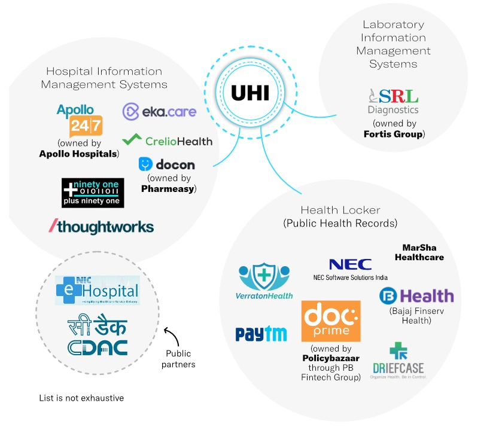
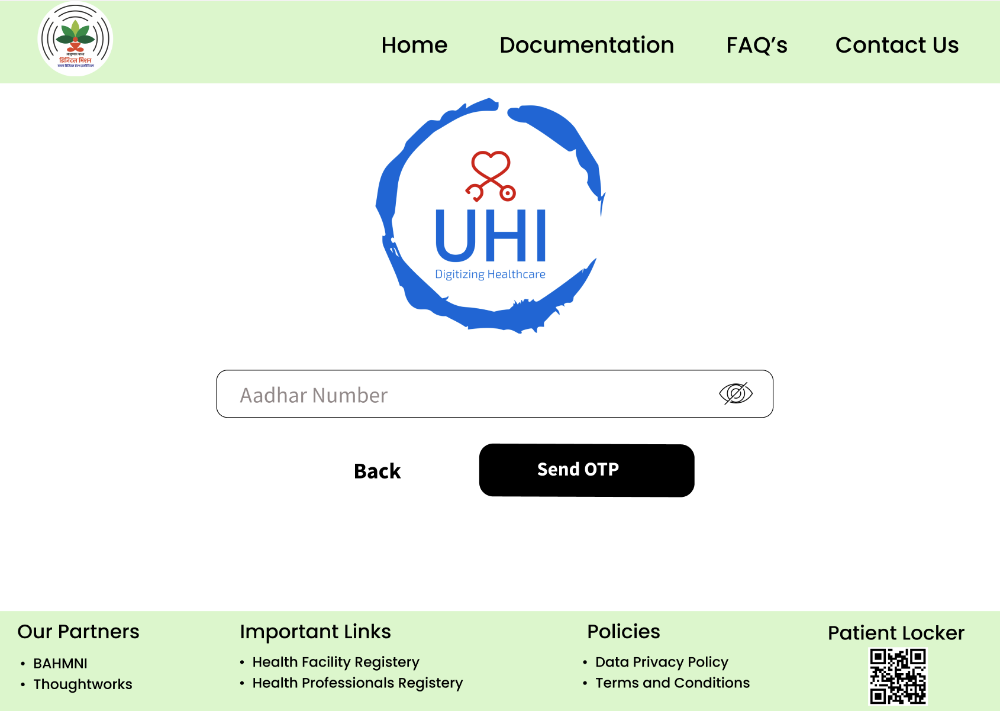

# Ayushman Bharat Digital Mission

The Ayushman Bharat Digital Mission(ABDM) aims to develop the backbone necessary to support the integrated digital health infrastructure of the country. It will bridge the existing gap amongst differ`ent stakeholders of Healthcare ecosystem through digital highways.

The Ayushman Bharat Health Account (ABHA) is a health ID developed by the Indian government. It uses a 14-digit identification number and can be generated using an Aadhaar card or your mobile number. It allows users to share their health records digitally with hospitals, clinics, insurance providers and others.
This was launched by the National Health Authority (NHA), which is part of the Ministry of Health and Family Welfare. As per the government, ABHA is the “first step towards creating safer and efficient digital health records for you and your family”. This was launched by the National Health Authority (NHA), which is part of the Ministry of Health and Family Welfare. The health records are being shared through a Health information exchange consent management system that ensures data is not shared among healthcare information providers and users without the approval of the person to whom data is related. Safe and secure mechanism to share health records. The individual can decide the reports/ records to be shared and the time period for which such record is to be shared.

## Front-End Framework

Out of all the available frameworks ReactJS and NextJS seemed to be the most suitable options, we decided to go with NextJS because of the following points

1) Search Engine Optimisation: As NextJS lets you build faster and more static web applications, while they also provided you the SEO and due to which the browsers make your web applications rank on top and get your website to first search pages

2) Coding Speed: Talking about ReactJS, If you want to create pages for your web application, you need to first create components and then additionally add them to the router whereas using NextJS can be very time saving for the developers, as if you want to add more pages to your web app, you just have to create the pages, and add them to the pages folder of the project directory, So that’s how NextJS speed’s up the coding process.

3) Performance: If your web application is built with NextJS, you will have to win the battle already because the features provided by the NextJS are awesome like Server-side rendering and static sites as they increase the performance of the web application.

## Wireframes

1) Adhaar OTP page

